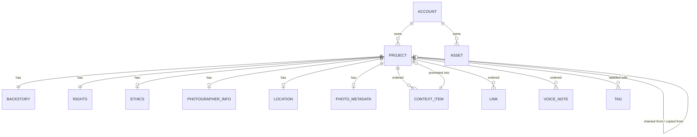

# Object model

How a Four Corners project is structured, in terms any stack can implement.
Nothing here assumes a particular database, object store or language.

The machine-readable version of this document is generated from the same
source the app validates against:

- `schema/project.schema.json` — the metadata document
- `schema/export-bundle.schema.json` — the file an export writes

Regenerate both with `npm run generate:schema`; a test fails if they drift
from the code.

Author: @thetechmargin · MIT

---

## 1. The four corners

A project is one photograph plus the context that makes it readable. The
context is organised into four corners, and the positions are normative — a
viewer that moves them is showing something else:

| Corner | Position | Holds |
|---|---|---|
| Context / Related imagery | upper-left | Other images, video and notes around the photograph |
| Links | upper-right | External references |
| Backstory | lower-left | The photographer's account of how it was made |
| Authorship & Ethics | lower-right | Credit, rights, consent and ethics disclosures |

Three things cut across the corners: **location**, **camera metadata**, and
**voice notes**.

---

## 2. Entities and fields

Types are written as portable primitives: `string`, `number`, `boolean`,
`timestamp` (ISO 8601 with offset), `uuid`, `enum(...)`, `array<...>`.
"Client-only" fields exist while editing and are never stored or exported.

### Project (the aggregate root)

| Field | Type | Required | Notes |
|---|---|---|---|
| `id` | uuid | yes | Assigned on creation |
| `ownerId` | uuid | yes | The account that may write it |
| `slug` | string | no | URL name, unique across the deployment, `[a-z0-9-]` |
| `title` | string | no | Display name |
| `metadata` | Metadata document | yes | Sections 2.1–2.9 |
| `mainImage` | blob reference or URL | no | The photograph itself |
| `published` | boolean | yes | Reachable by share link |
| `inGallery` | boolean | yes | Listed in the public gallery |
| `tags` | array\<string\> | yes | Lowercased, de-duplicated; 14 suggested values ship in `lib/tags.ts` |
| `lineage` | Lineage | yes | See §4 |
| `createdAt`, `updatedAt` | timestamp | yes | |

### 2.1 BackStory (lower-left)

`text`, `author`, `publication`, `publicationUrl`, `date` — all strings,
all default to empty. `author` is required for a project to count as
complete, which is an editorial rule, not a schema one.

### 2.2 ContextItem (upper-left, ordered list)

| Field | Type | Notes |
|---|---|---|
| `id` | string | Assigned by the writer; import may reassign (see §7) |
| `sourceType` | enum(upload, url) | Where the media came from |
| `type` | enum(image, video) | |
| `caption`, `description`, `credit`, `date` | string | |
| `filename`, `mimeType` | string | |
| `storage_path`, `thumbnail_storage_path` | string | Blob keys |
| `storage_url`, `thumbnail_storage_url`, `src` | string | Derived from the keys on read |
| `url` | string | External media, when `sourceType` is `url` |
| `audioStoragePath`, `audioStorageUrl`, `audioMimeType`, `audioDuration` | string / number | One spoken annotation per item |
| `linkedProjectId`, `linkedProjectSlug` | string | Set when the item was promoted into its own project |
| client-only | `blobId`, `thumbnailDataUrl`, `audioDataUrl`, `audioBlobId` | Local handles for media not yet uploaded |

Order is meaning: the array position is the display order.

### 2.3 Link (upper-right, ordered list)

`title`, `url`, `source` — strings. Links carry no identity of their own.

### 2.4 CreativeCommons / rights (lower-right)

`copyright` (free text that also carries the licence, e.g. "CC BY 4.0 —
Name") and `description` (the caption, and the fallback title).

### 2.5 CodeOfEthics (lower-right)

Four disclosures, each a boolean with a matching `*Details` string:
`noManipulation`, `noStaging`, `informedConsent`, `identityProtected`.
Plus optional `aiAltered` / `aiAlteredDetails`, `customEthicsText`, and
`consentDocumentUrl` (a private document, never published).

### 2.6 PhotographerInfo (lower-right)

`bio`, `contact`, `website`, `collaborators`. `contact` is personal data.

### 2.7 Location

`latitude`, `longitude` (numbers, nullable), `city`, `state`, `country`,
`formattedLocation`, `capturedAt` (timestamp), `source`
(enum: exif, device, manual), and a nested `address`
(`street`, `street2`, `city`, `district`, `stateProvince`, `postalCode`,
`country`). Coordinates are WGS 84 decimal degrees. Either store both
coordinates or neither.

### 2.8 PhotoMetadata

Read from the file on upload: `dateTaken`, and the sub-objects `equipment`
(make, model, lens, focal length, ISO, aperture, shutter speed),
`device` (software, artist, `copyright`, description), `image` (width,
height, orientation), plus `temporal` and `gps` as free-form sub-documents.
ISO and the image dimensions accept a number or a string, because cameras
disagree.

### 2.9 VoiceTranscription (ordered list)

`id`, `recordingId` (stable), `text`, `transcribedAt`, `fieldId` (which
editor field the note belongs to), `audioStoragePath` / `audioStorageUrl`,
`mimeType`, `duration` (ms). `audioDataUrl` and `audioBlobId` are
client-only.

### 2.10 Meta

`createdAt`, `updatedAt`, `editorVersion`, `mode`
(enum: minimal, standard, complete).

### 2.11 Asset (the owner's media library)

`id`, `ownerId`, `mediaType` (enum: image, video, audio, document),
`mimeType`, `fileName`, `bucket`, `key`, `thumbnailKey`, `fileSize`,
`width`, `height`, `duration`, `createdAt`. Assets outlive the projects
that reference them, and their sizes are what the storage quota counts.

---

## 3. Relationships



Deleting a project deletes everything that belongs to it. Deleting an
account deletes its projects and assets.

---

## 4. Lineage

One project can descend from another two different ways:

- **Chained** — a context image is promoted into its own project, which
  keeps a reference to the project it came from. The gallery groups a chain
  under its root.
- **Copied** — someone duplicates a project. A copy of your own project is a
  new version (`versionNumber` increments); a copy of someone else's is a
  fork, and records whose it was.

Both currently share one `parentProjectId` field, so a copy is
indistinguishable from a chained child. If you are re-implementing this,
give them separate fields.

---

## 5. Visibility and other rules

| State | `published` | `inGallery` | Who can see it |
|---|---|---|---|
| Private | false | false | The owner |
| Shared by link | true | false | Anyone with the link |
| In the gallery | true | true | Everyone, and it is listed |

Invariants the storage layer must hold, whatever enforces them:

- `inGallery` implies `published`. Adding to the gallery publishes;
  unpublishing withdraws from the gallery.
- Reads: a project is readable by its owner, or by anyone once `published`.
  The public API additionally requires `inGallery`.
- Writes: only the owner.
- Slugs are unique across the deployment.
- Ordered arrays keep their order.
- An optional cap on how many projects one account may keep in the gallery
  (`FC_GALLERY_LIMIT_PER_USER`; unset means no cap).

Storage limits:

| Kind | Per-file cap |
|---|---|
| Image | 25 MB |
| Video | 100 MB |
| Audio | 60 MB |
| Document | 20 MB |

Per-account totals come from a plan: free 1 GB, pro 10 GB, team 50 GB,
unlimited. The UI warns at 80% and turns critical at 95%. A ZIP import is
capped at 200 MB, 500 entries and 500 MB inflated.

---

## 6. Interchange format

An export writes one JSON document, `metadata.json`. Its root is the shape
the Four Corners Project's own viewer reads; everything this editor adds
sits under `_ext`:

```jsonc
{
  "backStory": { ... },
  "context": [ ... ],
  "links": [ ... ],
  "creativeCommons": { ... },
  "_ext": {
    "ethics": { ... },
    "photographerInfo": { ... },
    "location": { ... },
    "photoMetadata": { ... },
    "voiceTranscriptions": [ ... ],
    "meta": { ... },
    "mainImage": "image.jpg",
    "consentDocuments": [ ... ],
    "export": {
      "version": "1.1.0",
      "generator": { "name": "Four Corners", "designAndBuild": "...", "url": "...", "formatVersion": "1.1.0" },
      "assets": { "mainImage": { ... }, "context": [ ... ], "voice": [ ... ], "consentDocs": [ ... ] }
    }
  }
}
```

`_ext.export.version` is the **format** version (currently `1.1.0`; `1.0.0`
is also read). An unknown version warns and still imports what it
recognises. `_ext.export.assets` maps each piece of media to its path inside
the ZIP, and must be read before validation strips unknown keys.

A ZIP bundle contains:

```
metadata.json      the document above
manifest.json      IIIF Presentation 3.0 manifest
index.html         viewer that reads the files next to it
standalone.html    single file with everything embedded (optional)
README.txt         what the bundle contains
image.jpg          the photograph (+ image.thumb.jpg)
media/             context images and video (+ media/thumbs/)
audio/             context audio annotations
voice/             voice recordings
docs/              consent documents
```

Three serialisation flavours decide how media is referenced: embedded (data
URLs), bundle-relative (paths inside the ZIP), or reference (URLs).

---

## 7. Known gaps

Worth fixing in any re-implementation; documented here because they are
real behaviour today:

1. **The export has no project header.** Title, slug, tags, visibility and
   lineage live on the project, not in the metadata document, so an
   export → import round trip loses them.
2. **`parentProjectId` is overloaded** for chained children and for copies
   (§4).
3. **Voice-note anchors break on import.** Import assigns new ids to context
   items but leaves `fieldId` pointing at the old ones.
4. **Link and voice-note ids are not stable** across saves, so they cannot
   be used as external references.
5. **The licence is free text** inside `creativeCommons.copyright`. Storing
   an SPDX identifier or a licence URI alongside it would make it machine
   readable.
6. **IIIF canvases assume 1920×1080** when the image has no EXIF dimensions,
   and the manifest points voice audio at `./audio/` while the ZIP writes it
   to `voice/`.
7. **`meta.editorVersion` doubles as a format version** on import.

---

## 8. Mapping to a relational database

The deployment this code came from stored a project across normalised
tables. That layout is not required — a document store works, and the local
adapter uses one — but it is a good starting point, so it is recorded here.

| Table | Cardinality | Holds |
|---|---|---|
| `projects` | root | id, owner, slug, title, published, in_gallery, tags, main image key/URL, lineage, timestamps |
| `project_backstory` | 1:1 | §2.1 |
| `project_creative_commons` | 1:1 | §2.4 |
| `project_ethics` | 1:1 | §2.5 |
| `project_photographer_info` | 1:1 | §2.6 |
| `project_locations` | 1:1 | §2.7 |
| `photo_metadata` | 1:1 | §2.8 |
| `context_items` | 1:N, ordered by `position` | §2.2 |
| `links` | 1:N, ordered by `position` | §2.3 |
| `voice_transcriptions` | 1:N, ordered by `position` | §2.9 |
| `user_assets` | per account | §2.11 |

Conventions that layout used, and the reasons worth keeping:

- camelCase in the document ↔ snake_case in columns
  (`publicationUrl` ↔ `publication_url`), with three exceptions:
  `type` ↔ `media_type`, `sourceType` ↔ `source_type`, and the
  `storage_*` keys, which are snake_case in the document too.
- `address` is flattened into columns (`street`, `street2`, `address_city`,
  `district`, `state_province`, `postal_code`, `address_country`), and the
  camera sub-objects likewise (`camera_make`, `camera_model`, `lens_model`,
  `focal_length`, `iso`, `aperture`, `shutter_speed`, `software`,
  `host_computer`, `artist`, `exif_copyright`, `user_comment`,
  `image_description`). `exif_copyright` is named apart from the rights
  `copyright` on purpose.
- `temporal` and `gps` stay as JSON sub-documents.
- Ordering is an integer `position` column, not insertion order.
- Lineage is `parent_project_id`, `version_number`, `is_fork`,
  `forked_from_user_id`.

Derived data — search text, embeddings, geographic points, thumbnails — is
rebuildable and is not part of the model.

---

## 9. Access rules to re-implement

The original deployment enforced these in the database. Wherever you put
them, they must hold:

| Operation | Who |
|---|---|
| Create a project | any signed-in account, as its owner |
| Read a project | owner; anyone if `published` |
| Read through the public API | anyone if `published` and `inGallery` |
| Update or delete a project | owner |
| Read a public blob | anyone with the key |
| Read a private blob | owner; anyone holding a valid grant for a published project that references it; a short-lived signed link |
| Upload | owner, within the per-file cap and the account's quota |
